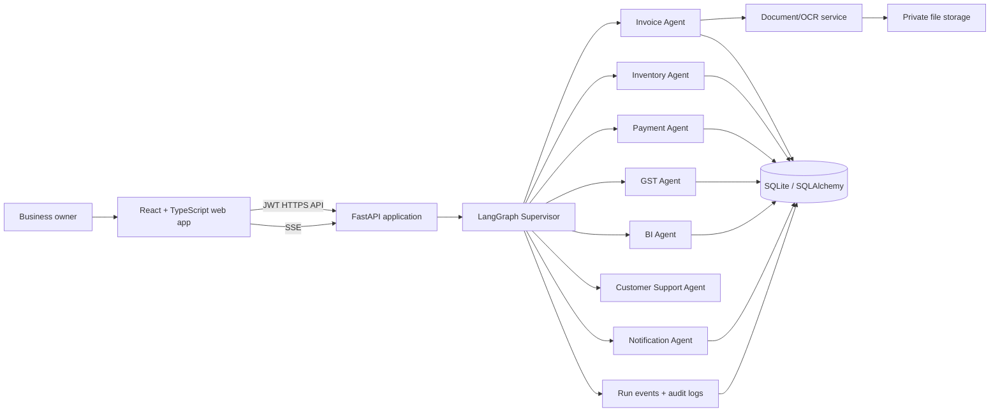
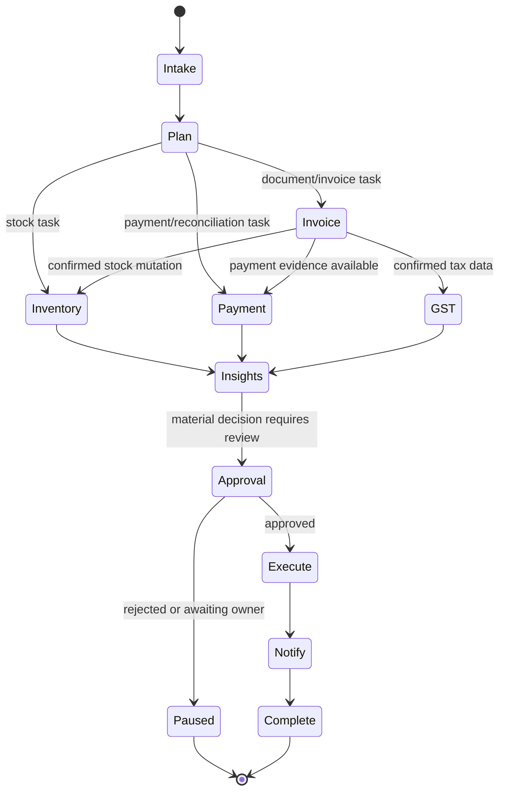

# AgentKart AI — Architecture

## 1. Product boundary

AgentKart AI is a multi-tenant back-office application for Indian MSMEs. An owner submits a natural-language request or business document and a **Supervisor Agent** plans, delegates, verifies, and records the resulting work. The web UI is both the operating console and an auditable view of the agent workflow.

The first release supports one organization per user account, with schema-level organization isolation so team accounts can be added later without redesigning the data model.

### Core user flows

1. A user signs in and lands on a concise business health dashboard.
2. They upload an invoice (PDF/image) or CSV, or issue a request in chat.
3. The Supervisor creates a durable run, invokes the required specialist agents, and streams status events to the UI.
4. A human reviews editable extracted invoice fields whenever confidence is low or a decision affects money/tax.
5. Confirmed data updates inventory, customer/payment/GST records and creates an immutable audit trail.
6. The dashboard and Agent Activity page show exactly what happened, which tool ran, and what changed.

## 2. System overview



### Runtime components

| Component | Responsibility | Technology |
| --- | --- | --- |
| Web app | User workflow, protected pages, review/approval UI, live run timeline | React, TypeScript, Vite, Tailwind, shadcn/ui |
| API | Authentication, validation, authorization, orchestration entrypoints, reporting APIs | FastAPI, Pydantic v2, SQLAlchemy |
| Agent runtime | Planning, delegation, agent state, retries, checkpoints, event emission | LangGraph, OpenAI SDK structured outputs |
| Domain services | Deterministic business mutations and reporting | Python service/repository layers |
| Document processor | MIME validation, malware-safe constraints, PDF text extraction, OCR and field normalization | PyMuPDF, pdfplumber, Pillow, Tesseract |
| Data store | Transactional operational data, runs, checkpoints, audit log | SQLite locally; Cloud SQL only if scale requires it |
| Blob store | Original user uploads and generated exports only | local volume in development; Google Cloud Storage in Cloud Run |

## 3. Backend design

The backend is a modular monolith. This makes the hackathon build deployable as one Cloud Run service while retaining boundaries that can later be split into workers/services if throughput demands it.

### Layering

```text
API routers → use cases/services → repositories → SQLAlchemy models
                         ↓
                  agent tool adapters
                         ↓
                LangGraph orchestration
```

- **Routers** only parse requests, enforce dependencies, and return response models.
- **Services/use cases** own business rules and database transactions.
- **Repositories** hide query implementation and enforce organization scoping.
- **Agent tools** are narrow, typed adapters over services; they never execute raw SQL or mutate records directly.
- **Agents** select and sequence tools but do not bypass validation, permissions, or approval rules.

### API surface

| Area | Representative routes |
| --- | --- |
| Auth | `POST /auth/register`, `POST /auth/login`, `POST /auth/refresh`, `GET /auth/me` |
| Documents | `POST /documents/upload`, `GET /documents/{id}`, `POST /documents/{id}/process` |
| Agent runs | `POST /agent-runs`, `GET /agent-runs/{id}`, `GET /agent-runs/{id}/events` (SSE), `POST /agent-runs/{id}/resume` |
| Invoices | CRUD, `POST /invoices/{id}/confirm`, exports |
| Inventory | products, stock movements, low-stock recommendations |
| Payments/customers | CRUD, matching/reconciliation actions, ledger endpoints |
| GST | summaries, monthly report and due-date endpoints |
| Analytics | dashboard KPIs, trends, recommendations |
| Notifications | draft, approve, send, delivery status |

All mutation endpoints require a valid JWT, organization membership, role permission, Pydantic validation, and an audit event.

## 4. Real agent orchestration

### Shared agent contract

Every specialist is represented by a LangGraph node with:

- **Input:** an explicit, Pydantic-validated task payload and organization/user context.
- **Memory:** run-scoped graph state plus persisted run/checkpoint history. Long-lived business facts remain in the database—not in a model prompt.
- **Tools:** least-privileged structured Python tools, each mapped to a domain service.
- **Output:** a structured result (`status`, `summary`, `artifacts`, `mutations`, `confidence`, `requires_approval`, `next_tasks`).

The OpenAI model is used for interpretation, task planning, field normalization, explanation, and tool selection. Deterministic services calculate totals, taxes, stock changes, and reports. This prevents the model from inventing financial mutations.

### Graph state

```text
AgentState
  run_id, organization_id, user_id, task
  plan[]
  active_agent
  artifacts[]
  proposed_mutations[]
  approvals_pending[]
  events[]
  retry_count, error
```

### Supervisor graph



### Specialist responsibilities and allowed tools

| Agent | Tools / deterministic authority | Output |
| --- | --- | --- |
| Supervisor | classify task, create plan, dispatch agents, validate completion | execution plan and consolidated response |
| Invoice | OCR/extract, normalize supplier/product data, create invoice draft | typed invoice draft with field confidence |
| Inventory | find/create product mappings, calculate stock movement, calculate reorder point | proposed stock movements and alerts |
| Payment | extract transaction reference, find candidates, score matches, update ledger after approval | match recommendation / reconciled payment |
| GST | classify intra/inter-state tax, aggregate confirmed invoices, calculate report totals | GST summary, due date, exceptions |
| BI | aggregate only verified data, calculate revenue/profit/trends, generate recommendations | KPI series and cited recommendations |
| Customer Support | lookup permitted customer/invoice data, draft bilingual response | response draft or invoice copy request |
| Notification | render template, queue approved notification, record delivery attempt | notification record/status |

### Approval and failure policy

- Automatic persistence is allowed only for low-risk drafts and derived data with high confidence.
- Invoice confirmation, stock movements, payment reconciliation, tax reports, and outbound messages require explicit policy checks; ambiguous/low-confidence cases pause for user review.
- Each node emits `queued`, `running`, `tool_call`, `completed`, `failed`, or `awaiting_approval` events. The UI maps these to the GitHub Actions-style timeline.
- Graph checkpoints allow `POST /agent-runs/{id}/resume` after owner approval or a transient failure.
- Tools are idempotent using `run_id`/operation keys; retrying a graph never duplicates payments or inventory movements.

## 5. Data model

All tenant-owned records include `organization_id`, timestamps, and where appropriate `created_by`. Monetary values use integer paise; tax rates use decimal values. Source documents are immutable.

| Table | Key fields / relationships |
| --- | --- |
| `users` | email, password hash, status |
| `organizations` | name, GSTIN, state code, settings |
| `organization_members` | user/org relation, role (`owner`, `manager`, `viewer`) |
| `documents` | storage key, hash, MIME, scan status, source metadata |
| `invoices` | vendor/customer, invoice number/date, subtotal/tax/total, status, document relation |
| `invoice_lines` | invoice, product, description, HSN/SAC, quantity, unit price, GST rate |
| `products` | SKU, name, HSN, reorder point, selling/cost price |
| `inventory_movements` | product, signed quantity, reason, source invoice, idempotency key |
| `customers` | name, phone/email, GSTIN, balance metadata |
| `payments` | customer, amount, reference, received date, status |
| `payment_allocations` | payment-to-invoice allocation amount |
| `gst_filings` | month, type, calculated totals, status, generated artifact |
| `notifications` | channel, recipient, content hash, delivery status, approval state |
| `agent_runs` | task, graph status, current node, summary, checkpoint reference |
| `agent_events` | run, sequence, agent, status, tool, structured payload, timestamps |
| `audit_logs` | actor, action, entity type/id, before/after redacted payload, request ID |

Indexes are added for organization/date queries, invoice number + vendor, product SKU, payment reference, run event sequence, and idempotency keys. Alembic migrations are the sole schema-change mechanism.

## 6. Document and ingestion pipeline

1. Validate authenticated organization, file extension, content signature, MIME type, size, page count, and filename.
2. Store the original using a generated object key; never use user filenames as paths.
3. Extract embedded PDF text first (PyMuPDF/pdfplumber); render and OCR only pages with insufficient text.
4. Normalize currency, dates, GSTIN, line items, and confidence signals with typed schemas.
5. Create an invoice draft and run event; do not mutate stock/tax/ledger until policy permits it.
6. Route confirmed data through Inventory, GST, Payment, and BI agents.

CSV uploads use a separate schema-mapping/preview path and never go through OCR.

## 7. Frontend architecture

Feature folders own views, API hooks, schemas, components, and tests. Shared primitives live in `components/ui`; domain-neutral utilities live in `lib`.

```text
app shell + route guards
  ├── landing/auth
  ├── dashboard
  ├── documents/invoices
  ├── inventory
  ├── payments/customers
  ├── gst
  ├── analytics
  ├── agent-activity
  └── settings
```

- React Router defines authenticated routes and role-aware navigation.
- TanStack Query owns server state, request caching, invalidation, and polling/SSE reconnect behavior.
- React Hook Form + Zod validates forms and supports editable extraction review.
- Recharts renders revenue, profit, and stock trends.
- React Flow visualizes the run plan/delegation; the activity timeline is a live event stream rather than a scripted animation.
- Light/dark mode uses CSS variables, accessible contrast, reduced-motion support, responsive layout, keyboard shortcuts, and proper empty/loading/error states.

## 8. Security and privacy

- Passwords use Argon2/bcrypt; JWTs are short-lived, signed from environment configuration, and refresh tokens are rotated/revocable.
- Dependency injection resolves the current user and organization before every tenant-scoped query.
- RBAC: owner manages organization/settings, manager operates business flows, viewer has read-only access.
- Rate-limit auth, uploads, and agent-run creation; cap file sizes/pages and model/tool iterations.
- Strict CORS allowlist, security headers, request IDs, redacted structured logs, and no secrets in source control.
- Generated SQL is avoided in agent tools; tool arguments are Pydantic validated and authorization-checked.
- PII and document contents are not placed in telemetry. Uploads are private and served with authorized/signed access only.

## 9. Deployment and operations

### Local development

- Docker Compose runs `api` and `web`; SQLite is mounted as a development volume and uploads use local storage.
- The API runs migrations on a deliberate bootstrap command, not implicitly in every request.

### Google Cloud Run

- Multi-stage Docker builds produce small, non-root images.
- The Vite build is served as static assets by FastAPI or a lightweight web server; initial implementation favors a single Cloud Run service for simple CORS/auth operations.
- Cloud Storage stores uploads/exports. SQLite is unsuitable for horizontally scaled Cloud Run, so production defaults to Cloud SQL PostgreSQL once multiple instances or persistent concurrent writes are required. For a low-traffic demo, set Cloud Run `max-instances=1` with a mounted-compatible persistent database strategy only if explicitly supported; otherwise use Cloud SQL.
- Environment values come from Secret Manager. Cloud Run service account has least-privilege access to its storage bucket and secrets.
- GitHub Actions runs lint/tests/build, builds and scans the image, pushes Artifact Registry, then deploys after protected-environment approval.

## 10. Quality gates

| Layer | Required verification |
| --- | --- |
| Backend | Ruff/format, mypy, pytest unit + API tests, migration smoke test |
| Agent runtime | graph routing tests, tool authorization tests, idempotency/retry tests, fixture-based extraction tests |
| Frontend | TypeScript strict build, ESLint, Vitest component/hook tests, route guard tests |
| End-to-end | Playwright: login → upload → review → approval → inventory/GST update → timeline |
| Security | auth/RBAC negative tests, upload validation tests, secret scan/dependency audit |

## 11. Delivery sequence

1. Establish repository structure and developer tooling.
2. Build the FastAPI foundation, schema migrations, JWT/RBAC, and deterministic domain services.
3. Build the React shell, auth flow, dashboard, and core CRUD/review surfaces.
4. Implement document ingestion and the LangGraph agents with durable run events.
5. Add analytics, exports, notification drafts, testing, Docker, CI/CD, and deployment documentation.

## 12. Explicit non-goals for the first release

- Direct WhatsApp or email delivery without configured provider credentials (the app will produce approved, auditable message drafts first).
- Filing GST returns with government portals; AgentKart prepares reports/reminders only.
- Fully autonomous posting of uncertain financial or tax transactions.
- Unbounded chat/tool execution or opaque agent decisions.

